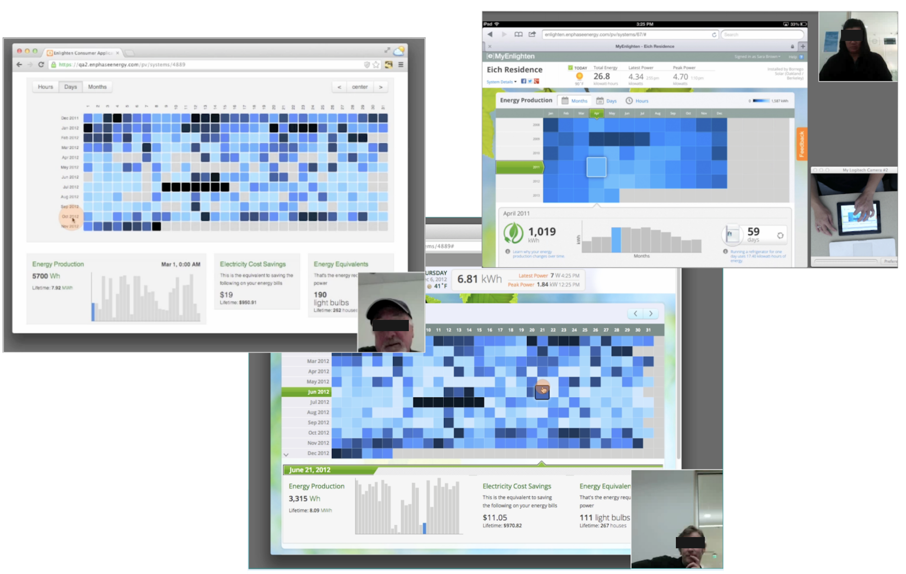

<!-- Main -->

<!-- One -->
<section id="one">
    

        <header class="major">
            <h1>Design Leadership: Integrating Energy Storage</h1>
        </header>
<!-- Content -->
        <h2 id="content">Project Overview</h2>
        
In 2014 Enphase Energy announced a residential battery that would integrate with its solar offering. While this represented a relatively small market, it required a complete re-thinking of the existing monitoring application. 

        

	       

		      <h3>My Role</h3>
               
In addition to leading the PM, UX and design teams in converting an R&amp;D concept to shippable product, I was responsible for:

               <ul>
                   <li>Initial app concept development and competitive analysis </li>
                   <li>Defining the user research approach, especially focus groups and surveys </li>
                   <li>Managing the iterative realization of the application in alignment with the overall hardware  launch </li>
                </ul>
            

            

                
                
                    Detail from brochure showing  battery + software concept at Solar Power International 2014
                
            

        

        

            

            <h3>Key Questions</h3>
                
 Adding storage moves users from passive observation of their systems to active monitoring and tuning. As we moved past initial concepting the following key questions emerged:

                <ol>
                    <li>How do we manage customer expectations of real-time interaction?</li>
                    <li>How can we help users understand flow of energy within the home?</li>
                    <li>How can we seamlessly integrate a home-based view into the existing solar-oriented application?</li>
                </ol>
            

                      

                
                
                    Team created "portable lab" for recording usability testing on multiple device formats
                
            

        

        

            

            <h4>Managing customer expectations</h4>
                
 Customers expected real time energy data that could not be delivered by the physical system. To address this, data recency was incorporated on the status banner and I directed the team to focus  the interaction design on creating a highly dynamic view of historical data.

            

            

                
                
                    Polling architecture avoids firewall issues but means data delays of 30 minutes or more
                
            

        

    
 
</section>

